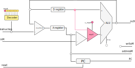

# 2020-2 AV3

> SIMULADO

| AV      | Pontos HW | Pontos SW |
| ------- | ------    | ------    |
| Teórica | 15        | 15        |
| Prática | 15        | 0         |

Simulado avaliação 3 de Elementos de Sistemas.

- **Trabalhar sozinho**
- **120 min** total (prática + teórica)
- Ficar conectado no canal geral (para ouvir instruções)

### Começando

Você deve:

1. clonar o seu repositório (e trabalhar nele)
1. editar o arquivo `ALUNO.json`
1. não esqueça de dar `commit` e `push`

## PARTE 1 - Teoria

Questões teóricas de:

- CPU
    - memoryIo
    - CPU
    - controlUnit
    - linguagem de máquina
    - Arquitetura do Z01

Usar como base para o estudo:

- Linguagem de máquina: https://docs.google.com/forms/d/e/1FAIpQLSc17TIBUEheKQfdzAwe6rvxslZP6cC1WtrqvMdWcesGLQWhUQ/viewform
- lab 15: https://insper.github.io/Z01.1/cpu-lab-1/
- Exercício CPU - 2: https://insper.github.io/Z01.1/Exercicio-CPU-2/
- Exercício CPU - 1: https://insper.github.io/Z01.1/Exercicio-CPU-1/

## PARTE 2 - Prática

Duas questões prática que envolvem modificar o HW da entrega F. A avaliação é auto contida, ou seja, fornecemos tudo que é necessário para realizar a mesma.

As questões de hardware (`.vhd`) devem ser implementadas nos arquivos localizados na pasta `src/rtl`. Para executar o teste  de HW basta executar o script:

``` bash
./testeAV2.py
```

> Vocês devem editar o arquivo `tests/config.txt` para inserir o módulo no teste.

**LEMBRE DE REALIZAR UM COMMIT (A CADA QUESTÃO) E DAR PUSH AO FINALIZAR**


### 1. ( 5 HW, 0 SW) novo mux

| Questão | Arquivo           | pts  |
|---------|-------------------|------|
| 1a      | `Q1_CPU.vhd`         | 2 Hw |
| 1b      | `Q1_ControlUnit.vhd` | 3 Hw |

Vamos modificar o HW adicionando um novo mux (`muxY`) para permitir que a saída do reg `%D` entre na entrada `Y` da ULA. Permitindo operações do tipo:

```
addw %D, %D, %A
```



A solução a seguir, utiliza do `bit 14` que estava 'sobrando' e faz ele controlar quem entra na entrada Y da ULA, se é a saída do mux `muxAM` ou se é o registrador `%D`.

Esse novo sinal é chamado de `r1`, e controla:

- `r1 = 0`: A entrada Y da ULA é a saída do muxAM
- `r1 = 1`: A entrada Y da ULA é o valor salvo em `%D`


#### a) `Q1_ControlUnit.vhd`

| Arquivo      | `Q1_ControlUnit.vhd`                                          |
|--------------|------------------------------------------------------------|
| Testando     | `./testeHW.py`                                             |

Agora será necessário alterar o `Q1_ControlUnit.vhd` para implementar o controle do novo sinal (`muxY`).

- :exclamation: é para implementar somente o sinal do muxY, os demais sinais já estão implementados!

#### b) `Q1_CPU.vhd`

| Arquivo  | `Q1_CPU.vhd`   |
|----------|----------------|
| Testando | `./testeHW.py` |

Edite o arquivo `Q1_CPU.vhd` adicionando o novo mux e faça o mapeamento para o `Q1_ControlUnit` controlar esse novo mux. Valide com o teste da CPU.

- :exclamation: Esse teste utiliza do ControlUnit modificado, ele deve estar passando no teste para você executar esse.

### 2. (10 HW, 0 SW) jump

| Questão | Arquivo              | pts   |
|---------|----------------------|-------|
| 2a      | `Q2_ControlUnit.vhd` | 10 Hw |

O instruction set do nosso Z01.1 não diferencia operações entre números do tipo sem
sinalização (unsigned) e com sinalização (complemento de dois, signed). Isso pode causar
alguns problemas.

Por exemplo, assuma o estado inicial da CPU com o valor a seguir no reg `%D`:

| REG  | Valor binário      | Valor Decimal     |
| ---  | ---                | -----             |
| `%D` | `1000000000000000` | `32767 ou -32768` |

E o que acontece se executamos uma operação de jump greater (`jg`) em `%D`?
Como CPU sabe se os valores salvos em `%D` são maiores ou menores que ZERO?

O problema é que a operação de jump não sabe se deve considerar o valor
salvo em `%D` como signed (complemento de dois)
ou unsigned (todos os bits usados para gravar o valor).

A operação de jump apenas olha as saídas do comparador: `ng` e `zr`.

- `ng != 0` e `zr != 0`: Salto ocorre
- `ng  = 1` ou `zr = 1`: Não acontece o salto
  - Aqui que está o erro, o ng é apenas um reflexo do bit `15`. O `ControlUnit` não sabe se o dado em questão é complemento de dois ou não.

Processadores resolvem esse problema, informando na instrução de jump se o dado 
a ser verificado é to tipo **unsigned** ou **signed**.

Vamos modificar o hardware para possibilitar que a operação de `jg` trate 
o sinal do registrador de duas maneiras diferentes:

- jg**u**: Considera o registrador como sendo do tipo unsigned
- jg**s**: Considera o registrador como sendo do tipo signed

Uma solução para implementarmos isso é a de utilizar o bit 16 das instruções 
do tipo C (que não tem uso no momento) para indicar se o número a ser operado 
é do tipo unsigned ou signed, como ilustrado a seguir:


Implemente o VHDL para o novo instruction set  (`Q2_ControlUnit.vhd`) que é referente somente ao jg**u** e jg**s** e que controla o sinal do loadPC (control unit).

> :exclamation: É para implementar somente o sinal do loadPC no caso do jgu e jgs, ignorar os demais sinais e demais casos!
> 
> `loadPC <= ......`
> 
> O teste só verifica essa condição.

Valide com o teste a implementação.

